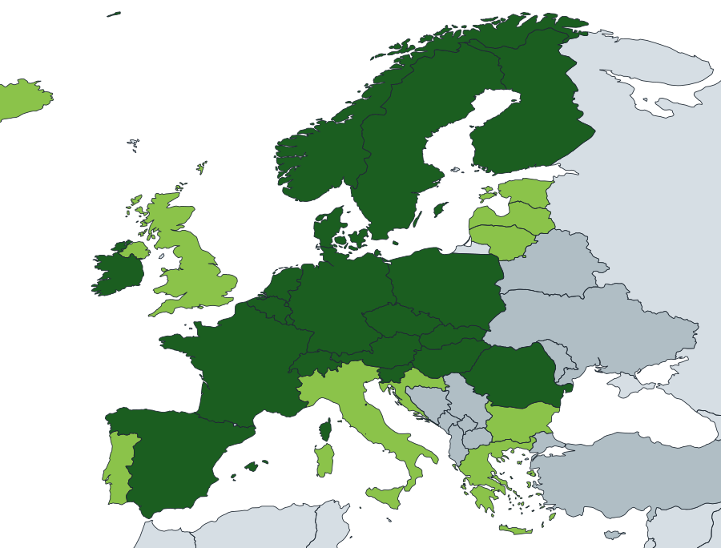
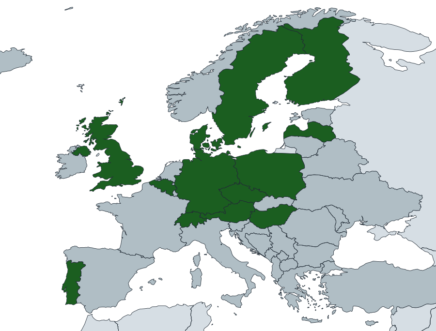
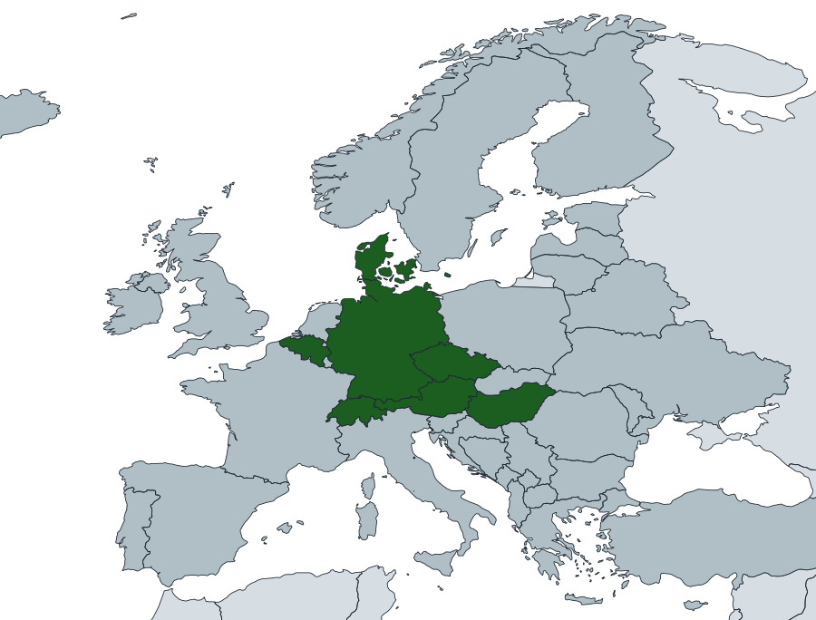

# Data coverage

These maps show WeatherDownload implementation status for European meteorological observation downloads.

- They are not FAO-readiness maps.
- They do not imply that all variables are available at all stations.
- They reflect WeatherDownload implementation status, not general public data availability in each country.
- Non-European land inside the current viewport is shown only as neutral geographic context and is not part of the coverage classification.

## Daily data coverage in Europe

  

- Dark green - national daily downloader implemented
- Light green - daily data available via GHCN-Daily
- Red - attempted, but no reliable daily support yet
- Gray - not attempted yet
- Very light gray - geographic context outside the European coverage classification

## Hourly data coverage in Europe

  

- Dark green - national hourly downloader implemented
- Red - attempted, but no reliable hourly support yet
- Gray - not attempted yet
- Very light gray - geographic context outside the European coverage classification

## 10-minute data coverage in Europe

  

- Dark green - national 10-minute downloader implemented
- Red - attempted, but no reliable 10-minute support yet
- Gray - not attempted yet
- Very light gray - geographic context outside the European coverage classification
